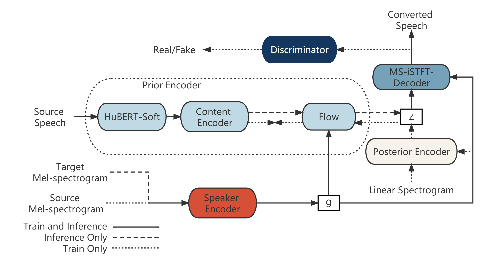

# QuickVC
This repository contains the open source code, audio samples and pretrained models of my paper: QuickVC: Any-to-many Voice Conversion Using Inverse Short-time Fourier Transform for Faster Conversion
## [Demo Page](https://quickvc.github.io/quickvc-demo)


## [Pretrained Model](https://drive.google.com/drive/folders/1DF6RgIHHkn2aoyyUMt4_hPitKSc2YR9d?usp=share_link)
Put pretrained model into logs/quickvc

## Inference with pretrained model
```python
python convert.py
```
You can change convert.txt to select the target and source
## Preprocess
1. Hubert-Soft
```python
cd dataset
python encode.py soft dataset/VCTK-16K dataset/VCTK-16K
```
2. Spectrogram resize data augumentation, please refer to [FreeVC](https://github.com/OlaWod/FreeVC).

## Train

```python
python train.py
```

If you want to change the config and model name, change:
```python
parser.add_argument('-c', '--config', type=str, default="./configs/quickvc.json",help='JSON file for configuration')
parser.add_argument('-m', '--model', type=str,default="quickvc",help='Model name')
```                   
in utils.py

In order to use the sr during training, change [this part](https://github.com/quickvc/QuickVC-VoiceConversion/blob/277118de9c81d1689e16be8a43408eda4223553d/data_utils_new_new.py#L70) to
```python
i = random.randint(68,92)
c_filename = filename.replace(".wav", f"_{i}.npy")
```    
## References
If you have any question about the decoder, refer to [MS-ISTFT-VITS](https://github.com/MasayaKawamura/MB-iSTFT-VITS).

If you have any question about the Hubert-soft, refer to [Soft-VC](https://github.com/bshall/hubert).

If you have any question about the data augumentation, refer to [FreeVC](https://github.com/OlaWod/FreeVC).
## If you meet any problem, welcome to contact with me.
